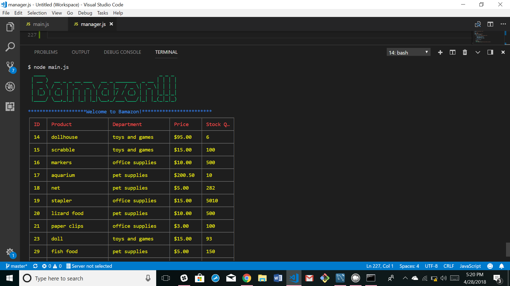

# Bamazon

This project was created by Jaime Halupka as a requirement for homework during University of Central Florida's Coding
Bootcamp. 

### Screenshot

### Description

This application is a simulation of a store. There are two experiences:
1. Under `main.js` the user can simulate a customer. They are prompted for an item and quantity. They are returned the total price, and the inventory in the store is adjusted within the MySQL database.
2. Under `manager.js` the user can simulate a manager. They are given several choices. They can examine a table of all items, examine a table of low-inventory items, add inventory to an item, or add an entirely new item to the store. Any adjustments made are reflected in the database.

### GIFs

### Node Packages Used

* mysql
* inquirer
* chalk
* cli-table
* figlet

